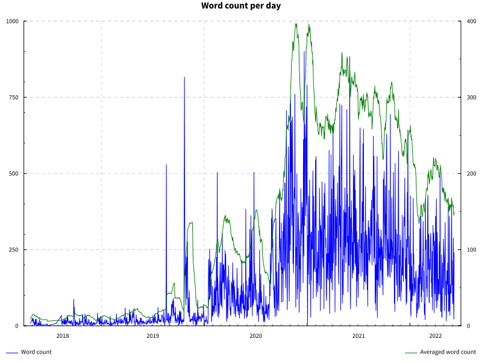

# Universum diary tools


This project contains Haskell tools to parse and output statistics for the now defunct [Universum](https://play.google.com/store/apps/details?id=ru.schustovd.diary&hl=de_CH&gl=CH) diary app.

## Running

This project is a normal cabal project, so you can just do `cabal run universum-diary-tools-exe`. It also uses Nix, so `nix develop` will give you a development shell.

## Examples

Say you made a backup of your Universum notes. This will be a `.zip` file. Extract it, and you get a file called `data.pr` (which is really a json file). This will be the input for all programs contained here.

To plot your mood over time, averaging over 30 days (it will be a moving average) use this command:

```
cabal run -- --input-file data.pr plot-mood --output-file mood.svg --average-days 30
```

To plot the number of words typed over time, use this command:

```
cabal run -- --input-file data.pr plot-word-count --output-file word-count.svg --average-days 30
```

The output of my word count so far, for example, is:


